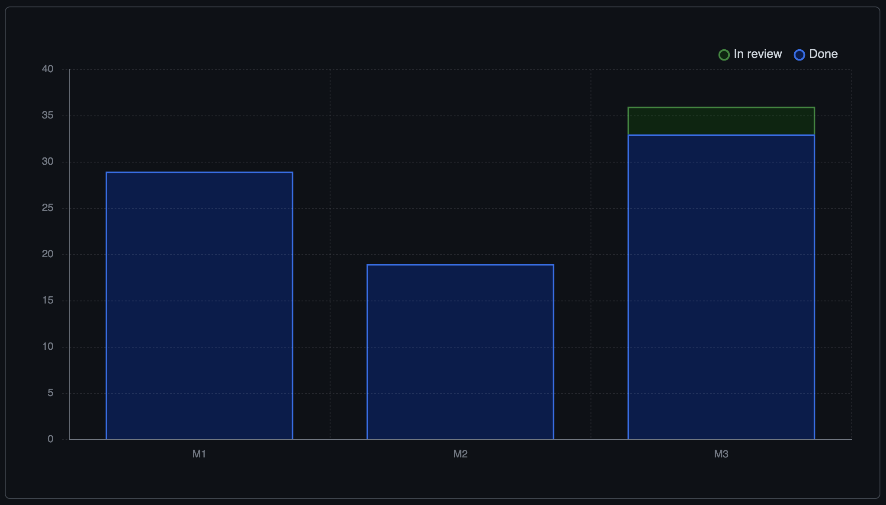

# Cardano Enterprise Db-sync
Cardano Db-Sync as a Service

## Goals
- Provide convenient access to Cardano blockchain data
- Secure access to a high-availability database system
- Pay-as-you-go: sign-up for a time period, extend, or cancel
- Offer blockchain analytics consulting to the Cardano community

## Milestones

### M1 Infrastructure
> [M1](https://github.com/Blockchain-Data-Analytics/Cardano_Enterprise/milestone/1)
* pipelines
* high-availability database system

### M2 Monitoring & Alerts
> [M2](https://github.com/Blockchain-Data-Analytics/Cardano_Enterprise/milestone/2)
* monitoring & alerts
* dashboards

### M3 User sign-up
> [M3](https://github.com/Blockchain-Data-Analytics/Cardano_Enterprise/milestone/3)
* web app
* backend processes

## Progress

Visit our [Kanban board](https://github.com/orgs/Blockchain-Data-Analytics/projects/1) to follow this project's progress.

#### Workload by milestones

#### [Project Info](./doc/README.md)