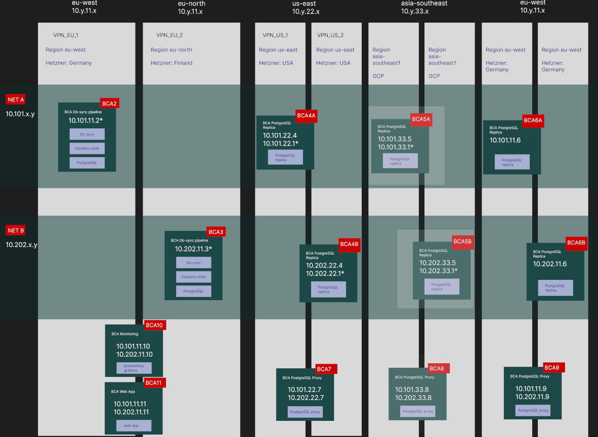
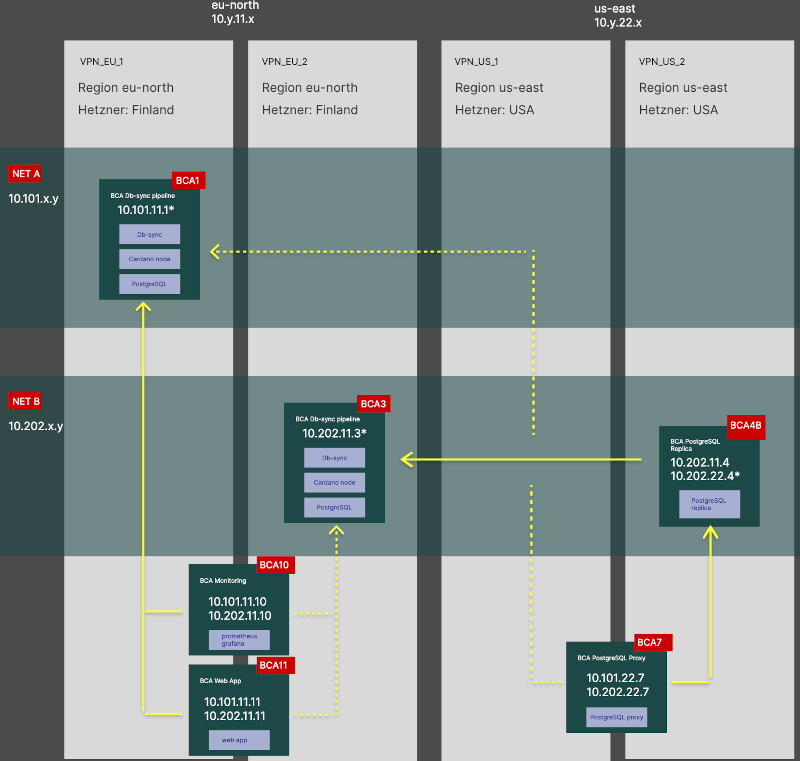

[back to index](README.md)

# Infrastructure

We will derive blockchain data in two independent pipelines and distribute these over two networks into regions "eu-west" and "us-east".
The region "asia-southeast" will be made available upon client request.

Users access the data within their region through proxies.

# Milestone 1: infrastructure and failover demonstration

In Milestone 1 we demonstrate the business continuity feature of redundant database access through a PostgreSQL proxy.
* in case of failure in one of the data pipelines, the proxy switches to use the other one
* regional database access for improved network performance

## Instances

For this purpose, we have setup:
* two independent Cardano node & Cardano Db-sync pipelines: _bca1_, _bca3_
* a PostgreSQL replica in North America: _bca4b_
* a client accessible PostgreSQL proxy in North America: _bca7_
* a server for the web app which also serves as a PostgreSQL proxy in Europe: _bca11_
* a server for monitoring our instances: _bca10_

## Internal networking

The two data pipelines are connected through VPN connections in their respective networks.

## User connections

Users of our services get access through dedicated PostgreSQL proxies in their regions. These proxies
connect to either pipeline. In case of failure of one of the pipelines, the proxy will automatically switch
to use the other one on the client's next login and query submission.
