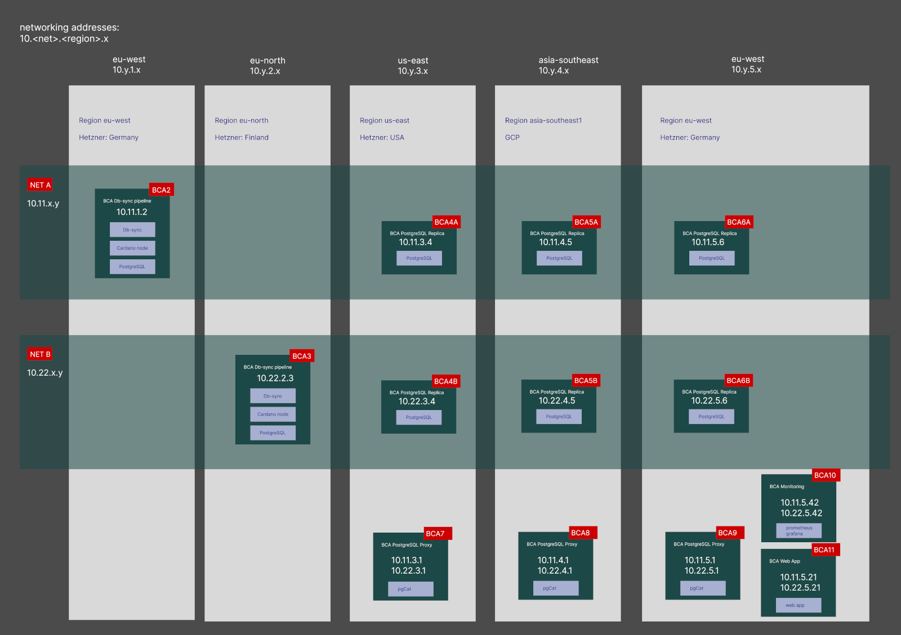

[back to index](README.md)

# Infrastructure

We will derive blockchain data in two independent pipelines and distribute these over two networks into regions "eu-west" and "us-east".
The region "asia-southeast" will be made available upon client request.

Users access the data within their region through proxies.

