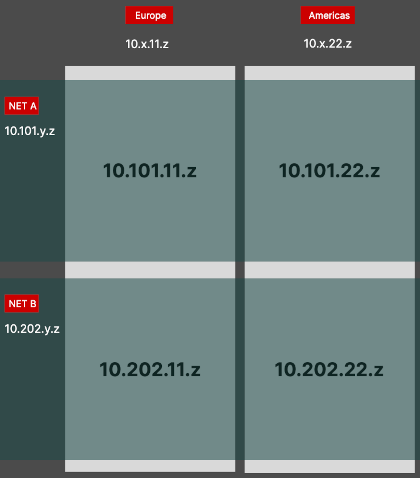

[back to index](README.md)

# Virtual Private Network

The computer instances that we setup for this project are connected through a virtual private network (VPN).

This allows us to define which instance is part of which pipeline network: either `10.101.*` for pipeline A or `10.202.*` for pipeline B. Additionally, the network address also encodes the geographic region that machine is physically placed in: `10.*.11.*` for Europe or `10.*.22.*` for Americas. A user from region R1 is preferrably served from services in the same region to benefit from lowest network latency.



## WireGuard

Our VPN is based on _[WireGuard](https://www.wireguard.com/)_. This is a versatile VPN implementation and provides high speed while it is also available on all major computer platforms.

on the VPN proxy server we do not forward the incoming traffic to the Internet. Instead, the traffic terminates at the server's end for accessing local services.
This gives a star like network topology where VPN clients can access services on the server.

If an instance starts exposing services, then a new `wg*` interface is setup with a fresh internal IP address.

### Key generation

run as root:
```sh
umask 077

mkdir -vp wireguard-keys

cd wireguard-keys

wg genkey > private

wg pubkey < private > public

wg genpsk > peer-bca42.psk
```

This will generate a pair of `private` and `public` keys as well as a preshared key.


### Debian setup

1. installation of required packages:  `apt install wireguard wireguard-tools`
2. create keys (see [Key generation](#key-generation))
3. define `wg*` interface (see [wg0 definition](#debian-wg0-interface-definition))
4. start the interface: `wg-quick up wg0`
5. punch a hole into the firewall: `ufw allow 51820/udp` (the port changes from interface to interface)
6. have _systemd_ autostart this interface: `systemctl enable wg-quick@wg0`

#### Debian wg0 interface definition

in file: `/etc/wireguard/wg0.conf`
```
[Interface]
Address = 10.202.11.42/16
SaveConfig = true
ListenPort = 51820
PrivateKey = DWI<..hidden..>4FQ=

[Peer]
PublicKey = q1v<..server's public key..>jh8=
PresharedKey = FR<..our preshared key..>elw=
AllowedIPs = 10.202.0.0/16
Endpoint = <server's real IP>:51820
PersistentKeepalive = 25
```

Key is the correct network mask. A network address `10.202.11.42` with mask of `/16` gives access to all addresses below `10.202.*.*`.

### NixOS setup

a server can define one or more VPN interfaces and list the peers that may connect to it. In this example the `wg0` interface is defined:

```nix
  networking.wireguard.interfaces = {
    wg0 = {
      # Determines the IP address and subnet of the server's end of the tunnel interface.
      ips = [ "10.202.11.1/16" ];

      # The port that WireGuard listens to. Must be accessible by the client.
      listenPort = 51820;

      privateKeyFile = "/root/wireguard-keys/private";

      peers = [
        {
          name = "bca42";
          # Public key of the peer.
          publicKey = "JP/Fxu4U<...>9ilvuA=";
          presharedKeyFile = "/root/wireguard-keys/peer-bca42.psk";
          # List of IPs assigned to this peer within the tunnel subnet. Used to configure routing.
          allowedIPs = [ "10.202.11.42/32" ];
        }
        # ...
      ];
    };
  };
```

a VPN client may define its interfaces as follows:

```nix
  networking.wireguard.interfaces = {
    wg0 = {
      ips = [ "10.202.11.42/24" ];
      listenPort = 51820;
      privateKeyFile = "/root/wireguard-keys/private0";
      peers = [
        {
          # the server's public key
          publicKey = "b1wbe7xnN<...>beZhjb4=";
          allowedIPs = [ "10.202.11.0/24" ];
          endpoint = "<server1 addr>:51820";
          persistentKeepalive = 25;
          presharedKeyFile = "/root/wireguard-keys/peer-bca42_0.psk";
        }
      ];
    };
    wg1 = {
      ips = [ "10.101.11.42/24" ];
      listenPort = 51841;
      privateKeyFile = "/root/wireguard-keys/private1";
      peers = [
        {
          publicKey = "k/fm7vlq26<...>wVzPnSY=";
          allowedIPs = [ "10.101.11.0/24" ];
          endpoint = "<server2 addr>:51841";
          persistentKeepalive = 25;
          presharedKeyFile = "/root/wireguard-keys/peer-bca42_1.psk";
        }
      ];
    };
  };
```

the above client is able to connect to two different networks within the same region.

```sh
[root@bca42:~]# netstat -anr
10.101.11.0     0.0.0.0         255.255.255.0   U         0 0          0 wg1
10.202.11.0     0.0.0.0         255.255.255.0   U         0 0          0 wg0
```

