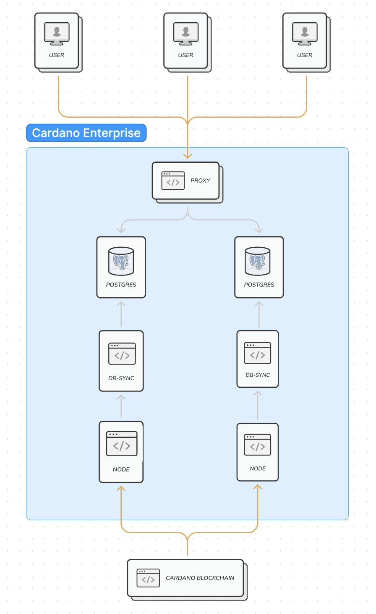

[back to index](README.md)

## High Availability

### Introduction
In this section we'll describe in detail how the system offers high availability, what are the advantages but also the caveats. We'll dive a bit deeper into the infrastructure and describe all the parts that make such a feature work.

### Setup
As it has been mentioned in the previous sections, Cardano Enterprise has two full db-sync pipelines. This means that there are two separate Cardano nodes syncing from the blockchain, two separate db-sync instances running and dumping the data into two separate Postgres databases. The two pipelines are deployed in separate physical instances, which offers better isolation. Aside from the high availability aspect when running a query, this has also some practical benefits: one of the pipelines can go offline for maintenance reasons for example, without affecting the users' access to the system. This setup enables us to guarantee to our users that the Cardano node and db-sync will always be up-to-date. 

### Active failover
In order to access the two different pipelines in a seamless way, there is a Postgres proxy in front of the databases. When a user sends a query to one of the databases, but that db for some reason goes offline, the query will fail. The proxy however will make sure that the next query will be sent to the second, healthy, instance. This switch will happen seamlessly to the user.

### Caveats
Db-sync is designed in such a way that internal ids are assigned to every Blockchain entity. For example, as you can see in the [schema documentation](https://github.com/IntersectMBO/cardano-db-sync/blob/master/doc/schema.md), every transaction is assinged a unique `id` in the tx table. Because of the fact though that these ids are internally generated, they are also unique to every database instance: the same transaction might have different ids in different databases.

This has as a result that in the fail over scenario, if a query is using one of those `id` fields and then it's send to another instance, the results might be different from what was expected. For this reason, we recommend to avoid using those fields in your queries and to be mindful of this `id` discrepancy during a failover.
