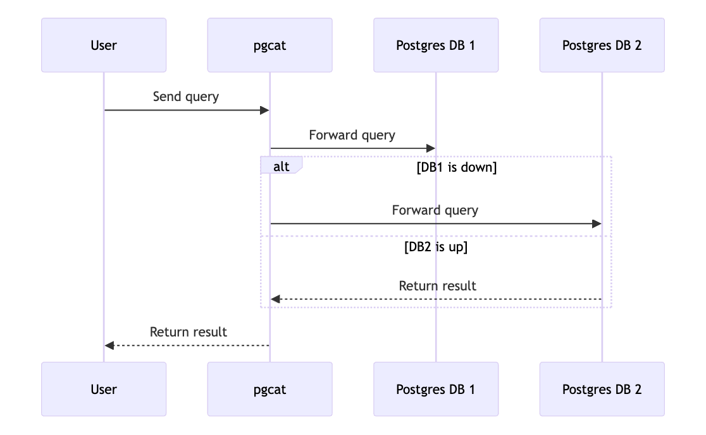

[back to index](README.md)

# How to use as a client

## Introduction
In this section we'll describe what options a user of the Cardano Enterprise has in order to explore the data.
Namely what are the options to get access to the data along with the tradeoffs of every option. 
The options are:
- Access to db-sync on the cloud
- Local replica
- Remote dedicated db-sync server

### Db-sync on the cloud 
Using this option, our users would get access to our high availability db-sync pipeline that we run for you. 
After the connection is set up successfully, you can send queries and get back data from db-sync, without the hassle of setting up a db-sync. A server would be selected in a region that is close to the user. If there is a failure, the query is directed in another server.  
Characterics: 
- Affordable
- Easy to set up: everything runs on the cloud
- Active failover: if a query for any reason fails (eg. server failure), it is directed to a healthy instance. This is shown in the following diagram:

Risks:
- Not local: since everything runs on cloud, users can experience increased latency due to network load
- Cannot use internal ids across databases: All the `id` fields in a db-sync database, are specific to this instance. In case of a fail over scenario, if you use any `id` field in your query, if that is directed to another server, you'll most probably get different results
- Performance is not guaranteed: Since the remote server is not dedicated, the speed that the user queries will be processed is not quaranteed

### Local replica
We also provide our users the option of running a local Postgres database, that is a replica of our db-sync instance. After syncing you local instance you get the best of both worlds: all the data you want, in a fast local database. 
Characteristics:
- Affordable
- Easy to set up: There is a delay in the initial syncing, but this would involve just some waiting time from the user side
- Fast: You connect to a local database, so the latency is very low

Risks:
- No fail over: The syncing happens with a specific remore machine. If there is a failure, because of the way db-sync is designed, the syncing must happen from scratch
- Depends on the local machine: if for any reason the local machine gets throttled, that could affect the speed of the local db-sync

### Db-sync on the cloud (dedicated)
This is the most decorated option a user can get. There is a dedicated server for the user running on the cloud.
Characteristics:
- Easy to set up: everything runs on the cloud
- Fail over: if for any reason the query fails, it gets redirected to another instance
- Quaranteed performance: In contrast with the previous options, we quarantee the performance of the queries in this option

Risks:
- Not that affordable: This is the most expensive option
- Cannot use internal ids across databases: similar to what happens in the simple "db-sync on the cloud"
- Not local: since everything runs on cloud, users can experience increased latency due to network load

Depending on your use case, please select the option that fits you best.
We would be looking forward to hear your feedback on bca@sbclab.net
