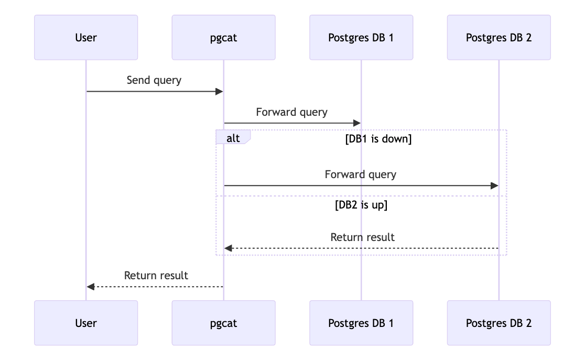

[back to index](README.md)

# Resiliency

## Introduction
This section explores the resiliency of the Cardano Enterprise project, which is foundational to delivering a reliable and robust service. Our focus on resiliency is twofold: enhancing scalability and ensuring high availability. These characteristics are critical as they ensure that our system can handle growing user demands and maintain service continuity under various conditions.

## Scalability
Scalability is paramount to our system's design, allowing it to accommodate an increasing load without compromising performance. We achieve scalability through two main strategies:

1. **Dynamic Load Balancing**: The Postgres Proxy plays a crucial role in managing load. It intelligently routes queries to the least busy database instances, ensuring efficient use of resources. This load balancing capability is key to maintaining fast response times as user demand increases.

2. **Scale-Out**: Our system monitors the load on database instances continuously. When the average utilization across instances exceeds 80%, the creation of new read replicas is initiated. These replicas are strategically placed in regions experiencing the highest demand, thus minimizing latency and improving user experience. This process is seamless and ensures that scalability is as responsive as possible to changing needs.

3. **Future Provisions for Dedicated Replicas**: Recognizing the diverse needs of our users, we plan to introduce the option for dedicated replicas. This will cater to users requiring isolated resources for enhanced control and performance at a slightly higher cost.

## High Availability
High availability is critical to ensuring that our services are always accessible, minimizing downtime and its associated costs. We implement high availability through the following mechanisms:

1. **Regional PostgreSQL Proxies**: Users connect to our services via dedicated PostgreSQL proxies located in their respective regions. These proxies are pivotal in managing connections to the databases efficiently and resiliently.

2. **Pipeline Redundancy**: Each proxy connects to multiple pipelines to guard against single points of failure. In the event of a pipeline failure, the proxy automatically switches to an alternative pipeline. This switch happens transparently during the user's next login and query submission, ensuring that the availability of our service is maintained.

3. **Monitoring and Failover**: Continuous monitoring of all critical components ensures that potential failures are identified and mitigated quickly. Our failover mechanisms are designed to be automatic and swift, thus preserving the continuity of service and ensuring that user operations are not disrupted.

By focusing on both scalability and high availability, the Cardano Enterprise project aims to deliver a resilient infrastructure that supports business continuity and user satisfaction.

